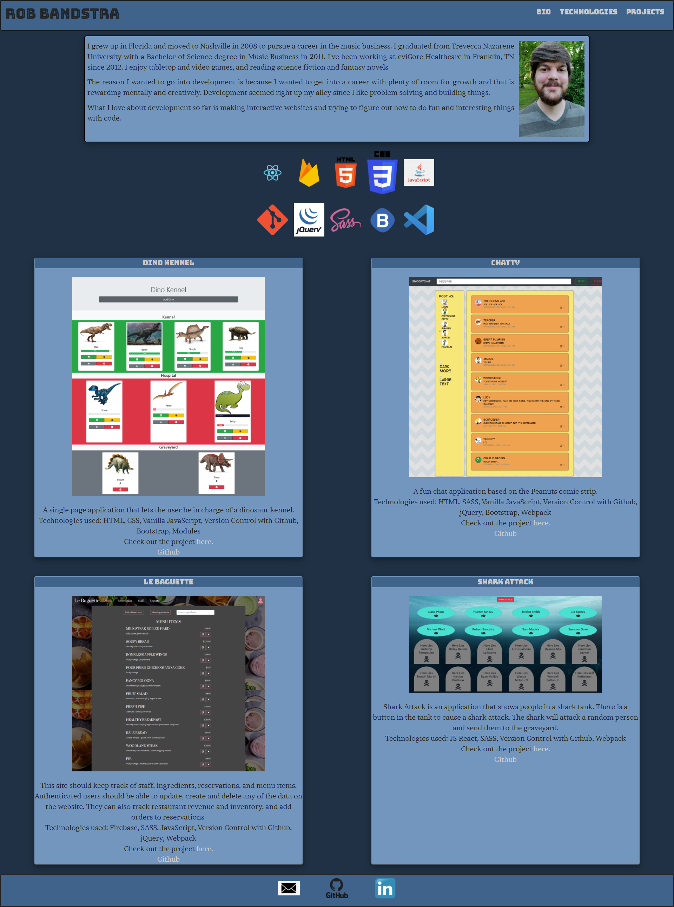

# Personal Bio Site

A personal bio site to show my personal background, list of tools and technologies I've learned, and projects I've completed.

This site uses HTML for the personal background and technologies sections and Javascript to print the project cards to the DOM. SASS and flexbox used to style the site. Webpack and Javascript modules used. Projects are stored on Firebase and app is deployed using Firebase.

## Link
[Link to deployed site](https://bio-site-1c584.web.app "Rob's Bio Page")
